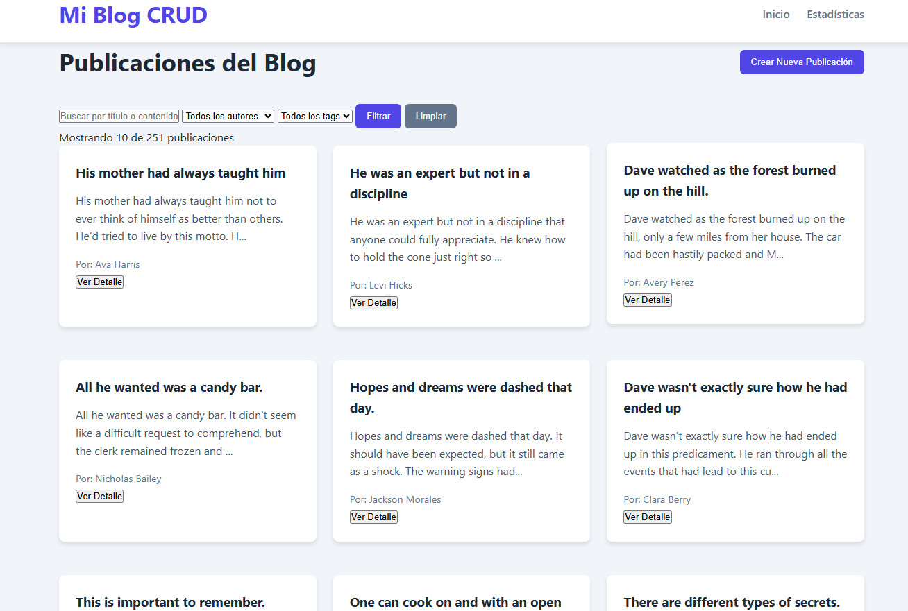

# Proyecto 1 - Blog CRUD

## Descripción

Aplicación de blog CRUD construida con HTML, CSS y JavaScript Vanilla. La aplicación consume la API pública de DummyJSON para realizar operaciones CRUD completas sobre publicaciones.

## API utilizada

- **DummyJSON**: https://dummyjson.com
- Operaciones usadas:
  - `GET /posts` para listar publicaciones
  - `GET /posts/{id}` para ver detalle
  - `POST /posts/add` para crear publicaciones
  - `PUT /posts/{id}` para actualizar publicaciones
  - `DELETE /posts/{id}` para eliminar publicaciones
  - `GET /posts/search` para búsqueda por texto
  - `GET /posts/tag/{tag}` para filtrar por tags
  - `GET /users` para cargar autores

## Requisitos cubiertos

- Listado paginado de publicaciones con `GET`
- Vista de detalle con al menos 6 campos del JSON
- Crear publicación con `POST`
- Editar publicación con `PUT`
- Eliminar publicación con `DELETE`
- Búsqueda por texto, filtro por autor y filtro por tags
- Sección adicional de estadísticas
- Validaciones de formulario en JavaScript
- Manejo de estados: carga, éxito, error y resultado vacío

## Cómo ejecutar

1. Abrir `index.html` en el navegador o usar un servidor local.
2. Si usas un servidor local, ejecuta desde la carpeta del proyecto:

```bash
npx serve
```

3. Abrir la URL que indique el servidor (por ejemplo `http://localhost:3000`).

## Estructura del proyecto

- `index.html` - punto de entrada de la aplicación
- `css/` - estilos globales y componentes
- `Js/` - lógica modular de la aplicación
  - `api.js` - funciones de `fetch` y llamadas a la API
  - `ui.js` - renderizado del DOM
  - `validation.js` - validaciones de formulario
  - `router.js` - navegación entre vistas
  - `main.js` - inicialización de la aplicación

## Integrantes

- Ivan Morataya 16667

## Notas

- El proyecto usa `DummyJSON` como API de backend simulado.
- Los cambios `POST`, `PUT` y `DELETE` se envían correctamente, pero la API no mantiene persistencia real.


-Video: https://youtu.be/Knxle_vvWco